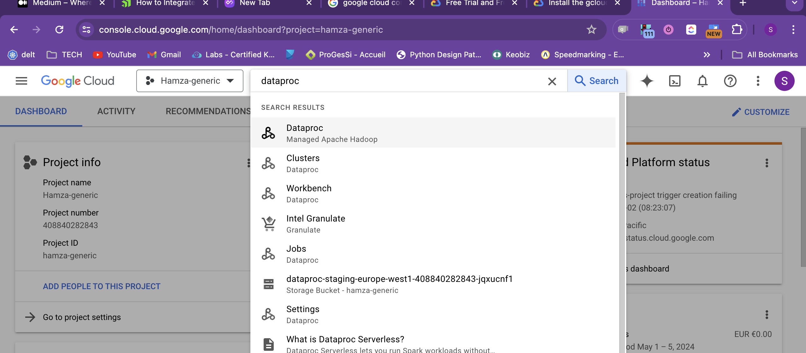
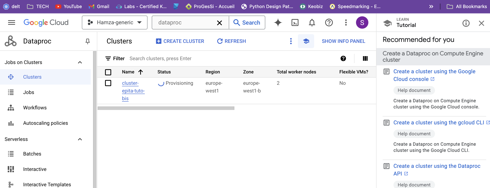

### Goal of this tutorial : 
This tutorial is the final of our little adventure with spark, the aim here is 
to make you as close as possible to a real world usage of spark on a cloud provider,
for that aim we will try to see in this tutorial : 
* How to spin up a spark cluster on Google cloud plateform GCP 
* How to interact with this cluster 
* How to Layout your jobs and submit them to the cluster
* As a bonus if we have time, we might see how to orchestrate jobs using cloud composer


### Spin up cluster on google cloud plateform
##### Pre-requisites on GCP

To interact with Google cloud assets, you have mainly 2 methods, either you use api clients or you use google cloud CLI. 

IAC (Infrastructure As Code) tools (like [pulumi](https://www.pulumi.com/) or [terraform](https://www.terraform.io/)) they use under the hoods api clients for interacting with your cloud plateform (GCP in our case)

In our tutorial we will interact with our assets trough the google cloud **CLI** *gcloud* 

We have provided a `Makefile`  to ease some of the commands running

#### Gcloud authentication 

##### Install gcloud & gsutil : 

Follow the instructions in the official [doc](https://cloud.google.com/sdk/docs/install) corresponding to your operating system to install gcloud & gsutil

Once installed, verify the installation with 

```bash
gcloud --help 
# Then run 
gsutil --help
```


##### Init gcloud : 
You will have to init gcloud to select your project 
```bash
gcloud init 
# Follows the steps until you get authenticated
```
######  Authorize gcloud + clients appi 

```bash
gcloud auth application-default login
# Then run 
gcloud auth login                    
```


######  Create a Google storage bucket

```bash
gcloud storage buckets create gs://pyspark-tutorial-<replace-by-your-login>
```

Then verify the creation of your bucket : 
```bash
gsutil ls 
>>> 
gs://pyspark-tutorial-<replace-by-your-login>/
```

######  Copy dataset NYC to the bucket
We will use the NYC dataset provided last time, copy its content under data/NYC/
then we will copy its content to the new bucket created

```bash
gsutil cp data/NYC/* gs://pyspark-tutorial-<replace-by-your-login>/data/NYC
# then verify that the copy went well
gsutil ls gs://pyspark-tutorial-<replace-by-your-login>/data/NYC
>>>
gs://pyspark-tutorial-senhaj-h/data/NYC/yellow_tripdata_2021-01.parquet
gs://pyspark-tutorial-senhaj-h/data/NYC/yellow_tripdata_2021-02.parquet
gs://pyspark-tutorial-senhaj-h/data/NYC/yellow_tripdata_2021-03.parquet
gs://pyspark-tutorial-senhaj-h/data/NYC/yellow_tripdata_2021-04.parquet
gs://pyspark-tutorial-senhaj-h/data/NYC/yellow_tripdata_2021-05.parquet
gs://pyspark-tutorial-senhaj-h/data/NYC/yellow_tripdata_2021-06.parquet
gs://pyspark-tutorial-senhaj-h/data/NYC/yellow_tripdata_2021-07.parquet
gs://pyspark-tutorial-senhaj-h/data/NYC/yellow_tripdata_2021-08.parquet
gs://pyspark-tutorial-senhaj-h/data/NYC/yellow_tripdata_2021-09.parquet
gs://pyspark-tutorial-senhaj-h/data/NYC/yellow_tripdata_2021-10.parquet
gs://pyspark-tutorial-senhaj-h/data/NYC/yellow_tripdata_2021-11.parquet
gs://pyspark-tutorial-senhaj-h/data/NYC/yellow_tripdata_2021-12.parquet
```
As a reminder on the dataset schema and fields here is a brief description :

1. **VendorID**: A code indicating the provider associated with the trip record.

2. **passenger_count**: The number of passengers in the vehicle. This is a driver-entered value.

3. **trip_distance**: The elapsed trip distance in miles reported by the taximeter.

4. **RatecodeID**: The final rate code in effect at the end of the trip.

5. **store_and_fwd_flag**: This flag indicates whether the trip record was held in vehicle memory before sending to the vendor, because the vehicle did not have a connection to the server.

6. **PULocationID**: A code indicating the location where the meter was engaged.

7. **DOLocationID**: A code indicating the location where the meter was disengaged.

8. **payment_type**: A numeric code signifying how the passenger paid for the trip. Different codes correspond to payment methods like cash or credit card.

9. **fare_amount**: The time-and-distance fare calculated by the meter.

10. **extra**: Miscellaneous extras and surcharges, which could be for rush hour, night time, or other special circumstances.

11. **mta_tax**: MTA tax that is automatically triggered based on the metered rate in use.

12. **tip_amount**: Tip amount – This field is automatically populated for credit card tips. Cash tips are not included.

13. **tolls_amount**: Total amount of all tolls paid in trip.

14. **improvement_surcharge**: A fixed fee assessed on every trip in certain geographical areas at certain times. 

15. **total_amount**: The total amount charged to passengers. Does not include cash tips.

16. **congestion_surcharge**: A surcharge applied in peak hours in congested areas.

17. **airport_fee**: A surcharge for trips to/from the airport.


###### Create a dataproc cluster 
```bash
# Check the content of the make command before run it, and replace BUCKET_NAME
make create_cluster
```

Congrats : now go to your google cloud console and go to the research bar and 
 search for `dataproc` you should find
your cluster :



We will open a notebook on the cluster, to experiment but then we will 
write our analysis as jobs 


Now take a look to the structure of src : 

src/
┣ jobs/
┃ ┣ hello_spark/
┃ ┃ ┣ __init__.py
┃ ┃ ┗ main.py
┃ ┣ trip_analysis/
┃ ┃ ┣ __init__.py
┃ ┃ ┗ main.py
┃ ┣ trip_analysis_bis/
┃ ┃ ┣ __init__.py
┃ ┃ ┣ distance.py
┃ ┃ ┣ duration.py
┃ ┃ ┗ main.py
┃ ┗ __init__.py
┣ utils/
┃ ┣ __init__.py
┃ ┗ shared.py
┣ main.py
┗ main_tmp.py


For what's comming next we will do on the dataset an analysis on : 


Session Assignement 

1. **Trip Analysis**: 

   - Average duration and distance of rides: Compare these metrics by time of day, day of week, and month of year. This can reveal patterns such as longer trips during rush hours, on weekends, or during holiday seasons. 

   - Popular locations: Identify the top 10 pickup and dropoff locations. This could be interesting when mapped visually.
   

2. **Tip Analysis**:

   - Tip percentage by trip: Do some locations tip more than others? Is there a correlation between distance and tip? 

   - Tips by time: Does the time of day, week, or even year affect tipping behavior? You could cross-reference this with holidays or events.
   
   - Does the payment type affect the tipping


3. **Fare Analysis**:

  - Can you calculate the average fare by pull & drop location ?
  - Can you calculate the average fare by Passenger count ? to see if there is any correlation with passenger count and fare amount
  - Can you correlate the fare amount and the distance trip ? 


4. **Traffic Analysis**:

   - Trip speed: Create a new feature for the average speed of a trip, and use this to infer traffic conditions by trying to find if for similar trip (when they exist) they more or less have the same avg speed or not, try then to group the avg speed by trip then hour, day, week 